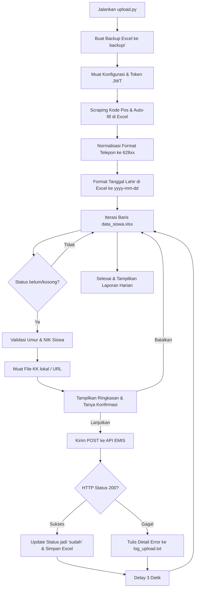

# 🚀 EMIS Student Data Upload Tool

[](https://python.org)
[](https://pandas.pydata.org)
[](https://requests.readthedocs.io)
[](https://opensource.org/licenses/MIT)

**EMIS Student Data Upload Tool** adalah aplikasi otomasi berbasis Python yang dirancang khusus untuk membantu institusi pendidikan mengunggah data siswa secara massal (*bulk upload*) ke API EMIS (Education Management Information System) Kemenag RI dengan aman, cepat, dan terstruktur.

---

## 🌟 Fitur Utama

*   📂 **Arsitektur Modular (Clean Code)**: Kode utama telah dipecah menjadi modul-modul terpisah (`config`, `utils`, `kk_handler`, `postal`, `api`) untuk keterbacaan tinggi dan kemudahan pemeliharaan.
*   📮 **Auto-fill Kode Pos (Web Scraping)**: Mengisi otomatis kolom kode pos (`postal_code_num`) yang kosong berdasarkan kode wilayah kelurahan (`m_subdistrict_id`) dengan scraping langsung dari situs `kodepos.nomor.net`.
*   📅 **Auto-formatting Tanggal Lahir (Kritis)**: Otomatis mem-parse dan menformat kolom tanggal lahir siswa, ayah, dan ibu ke tipe data `date` resmi Excel dengan format visual **`yyyy-mm-dd`**.
*   📞 **Normalisasi Nomor Telepon**: Konversi otomatis nomor handphone ayah/ibu dari format lokal (`08xxx` atau `8xxx`) ke format internasional standar API EMIS (`628xxx`).
*   🖼️ **Fleksibilitas Dokumen Kartu Keluarga**: Mendukung pengunggahan KK dari berkas fisik lokal di folder `kartu_keluarga/` maupun unduh dinamis dari URL (HTTP/HTTPS) cloud.
*   🔒 **Keamanan & Backup Otomatis**: Secara otomatis membuat cadangan file Excel (`backup_YYYYMMDD_HHMMSS.xlsx`) sebelum memproses data untuk menghindari kehilangan informasi.
*   📊 **Validasi Data & Logging**: Validasi NIK 16 digit, pengecekan duplikat NIK, validasi logika umur masuk sekolah, serta pembuatan laporan terperinci ke berkas `log_upload.txt`.

---

## 🛠️ Persyaratan Sistem & Instalasi

Pastikan komputer Anda telah terpasang **Python 3.7+**. Pasang pustaka pendukung yang diperlukan menggunakan `pip`:

```bash
pip install pandas openpyxl requests requests-toolbelt beautifulsoup4
```

---

## 📁 Struktur Berkas Proyek

Berikut adalah struktur folder dan pembagian modul aplikasi:

```
├── config.txt              # Konfigurasi Token JWT & Tanggal Masuk (Buat dari template)
├── data_siswa.xlsx         # Database Excel berisi data siswa (Diabaikan dari Git)
├── data_siswa_example.xlsx # Template data siswa untuk pengisian awal
├── kartu_keluarga/         # Folder tempat berkas KK lokal (.jpg) jika tidak menggunakan URL
├── wilayah.csv             # Database luring referensi kode wilayah Indonesia
│
├── upload.py               # Entry point utama (koordinator jalannya program)
├── config.py               # Modul pemuatan config.txt dan inisialisasi konstanta
├── utils.py                # Modul fungsi pembantu, logger, dan validator data
├── kk_handler.py           # Modul pemrosesan dokumen KK (download URL & load lokal)
├── postal.py               # Modul scraping kode pos & normalisasi Excel (ponsel & tanggal)
├── api.py                  # Modul pembangun payload form-data & komunikasi API EMIS
│
├── kode_wilayah.py         # Alat bantu interaktif untuk mencari kode wilayah desa/kelurahan
├── autofill_postal_code.py # Utilitas mandiri untuk mengisi kode pos Excel
├── test_kodepos.py         # Skrip uji coba scraping kode pos
└── log_upload.txt          # Laporan log hasil eksekusi unggah siswa
```

---

## 🔄 Alur Kerja Eksekusi

Skrip utama [upload.py](file:///e:/laragon/www/python/emis/upload.py) mengoordinasikan modul-modul pendukung dengan alur kerja berikut:



---

## ⚙️ Langkah Setup & Konfigurasi

### 1. File Konfigurasi (`config.txt`)
Salin file `config.exp.txt` menjadi `config.txt` lalu isi data yang sesuai:
```ini
academic_year_id = 21
admission_date = 2026-07-13
token = <Masukkan_Token_JWT_EMIS_Di_Sini>
```
> [!IMPORTANT]
> Token JWT memiliki masa berlaku yang terbatas (sekitar 4.5 jam). Jika Anda mendapatkan respons status kode `401 Unauthorized`, segera perbarui token Anda di file `config.txt`.

### 2. Penyiapan Berkas Kartu Keluarga
Anda dapat memilih salah satu metode di bawah ini:
*   **Opsi Lokal**: Taruh file KK siswa di dalam folder `kartu_keluarga/` dengan nama berkas sesuai nama lengkap siswa (Contoh: `MAFAZA ZALINA MARYAM.jpg`).
*   **Opsi URL Cloud**: Isi kolom `kartu_keluarga` pada file Excel dengan URL langsung berkas gambar/PDF (Contoh: `https://sim.sekolah.sch.id/storage/kk/260001.jpg`).

---

## 🚀 Panduan Penggunaan Skrip

### 1. Unggah Siswa (Utama)
Jalankan skrip utama untuk memproses pembersihan data dan mulai mengunggah data siswa ke EMIS:
```bash
python upload.py
```
Program akan meminta konfirmasi interaktif `➡️ Lanjutkan upload? (Y/N):` sebelum mengirimkan setiap data siswa ke server.

### 2. Pencarian Kode Wilayah
Gunakan alat interaktif untuk mencari kode wilayah 10-digit kelurahan/desa dari database `wilayah.csv`:
```bash
python kode_wilayah.py
```

### 3. Pengisian Kode Pos Mandiri
Jika Anda hanya ingin melakukan scraping dan mengisi kode pos pada berkas Excel tanpa melakukan upload:
```bash
python autofill_postal_code.py
```

---

## 📋 Aturan Validasi & Atribut Data

| Nama Field Excel | Target API Field | Aturan & Validasi | Nilai Fallback / Penanganan |
| :--- | :--- | :--- | :--- |
| `nik` | `nik` | Wajib 16 digit angka, tidak boleh duplikat di Excel | Siswa dilewati jika tidak memenuhi syarat |
| `birth_date` | `birth_date` | Tahun $\ge$ 2005, harus $\le$ `admission_date` | Otomatis diformat ke visual `yyyy-mm-dd` |
| `father_birth_date` | `father_birth_date` | Tahun kelahiran ayah $\ge$ 1950 | Otomatis diformat ke visual `yyyy-mm-dd` |
| `mother_birth_date` | `mother_birth_date` | Tahun kelahiran ibu $\ge$ 1950 | Otomatis diformat ke visual `yyyy-mm-dd` |
| `father_phone_number` | `father_phone_number` | Dikonversi ke format internasional (`628xxx`) | Diisi kosong jika nomor tidak valid |
| `siblings_num` | `siblings_num` | Jumlah saudara kandung (Wajib diisi API) | **Fallback `"0"`** jika kosong/NaN di Excel |
| `status` | - | Status unggahan siswa | Hanya memproses siswa dengan status `belum` atau `""` |

---

## 🛡️ Catatan Keamanan

*   Berkas `config.txt` yang berisi Token JWT rahasia telah ditambahkan ke berkas `.gitignore` agar tidak sengaja terunggah ke repositori Git publik.
*   Database siswa `data_siswa.xlsx` dan berkas KK di folder `kartu_keluarga/` mengandung data pribadi (PII) sensitif dan juga diabaikan dari Git.
